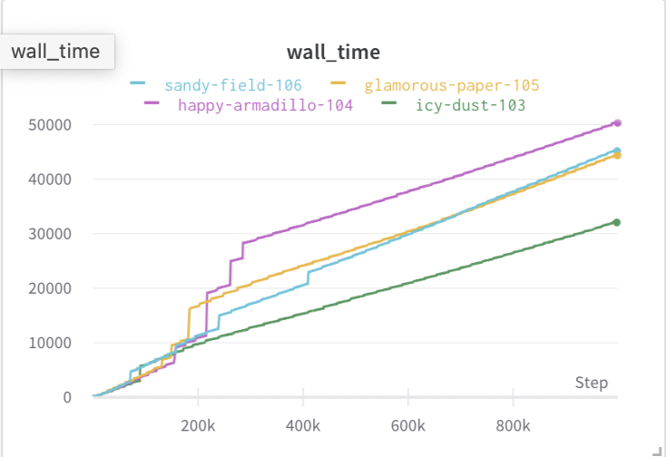
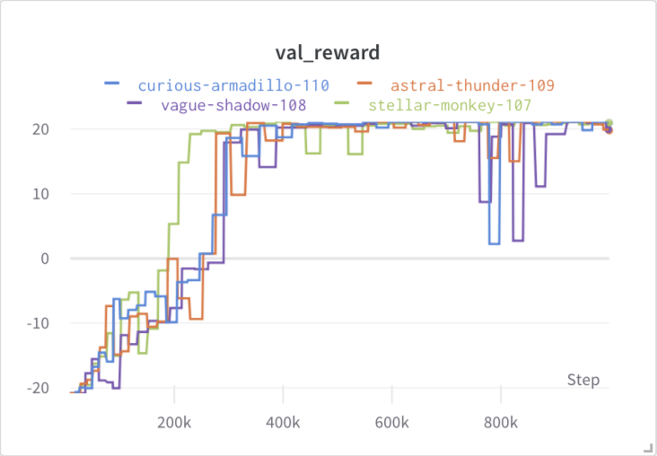
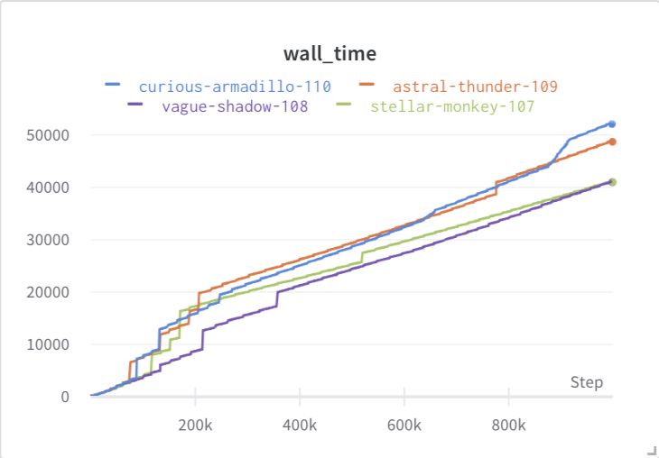

### Introduction
End-to-end learning algorithms for tasks like robotic manipulation and autonomous driving often consume raw pixels (in the case of cameras) as a representation of the current environment state. These systems hope to learn a nonlinear mapping from images to control policy in a way that optimizes some sort of objective. However, it is often hard to successfully train such a visuomotor model to convergence in a way that yields good performance. This is especially obvious in reinforcement learning research, with classic approaches like DQN requiring hundreds of millions of image frames to converge (sometimes unstably). One common hypothesis is that images are a very high-dimensional input, and it may be difficult to efficiently learn a mapping from state to control. For our project, we investigate different methods of visual representation learning for reinforcement learning in the ATARI Pong game. We incorporate auxiliary tasks specific to the game when training an autoencoder to learn visual representations that better inform reinforcement learning policies in these domains. We are able to empirically show that our approach trains DQN policies that are more sample efficient and stable than the baseline DQN approaches. 

### Related Work
Previous work has used multi-task setups to augment the performance of learned planners (ChauffeurNet, Uber NMP). ChauffeurNet is an imitation learning approach that seeks to push the boundaries of completely offline (non-interactive) imitation learning. A major component of their approach is using trajectory perturbations and random object removal to synthesize new and interesting scenarios from recorded driving data. The model is trained to overcome these these synthesized, possibly dangerous scenarios by using a multi-task loss that penalizes bad behavior (e.g. collisions, going off-road). Similarly, the Neural Motion Planner approach uses inverse RL to predict a spatiotemporal cost volume that is used to grade proposed trajectories, with the minimum cost trajectory chosen as the plan. The cost volume is trained alongside auxiliary perception tasks that are claimed to make the learned cost volumes more interpretable.

Our approach similarly uses auxiliary perception tasks for representation learning in reinforcement learning. Our approach is closely related to a recent work called MaRLn that uses end-to-end reinforcement learning for driving in simulation. MaRLn hypothesizes that images are not good representations for RL state because they are too large and contain a lot of irrelevant information. Their idea is to replace the image state with a smaller compressed representation with the key novelty here being how that representation is produced. The authors adopt an autoencoder approach and use a multi-task loss which trains the network to encode the image into a small latent space, and then decode it to perform various tasks like semantic segmentation and some regression tasks. In theory, this latent space should contain information that is relevant to the task at hand while reducing the memory footprint of the replay buffer. 

- Note - we want to focus on how awful it is to have high dimensional state
- Need to talk about DQN original results and the drawbacks

### Approach
The classic ATARI games are a simple testbed for training and evaluating autonomous agents and are popular because they naturally provide interesting, dynamic environments (often with an explicit reward structure). We worked with the classic Pong game. The OpenAI Pong implementation has three main classes of actors: the player agent, the other agent, and the ball. The goal of the game is to get the ball past the other agent. For each ball that our player agent gets past the other agent, we receive 1 reward. For each ball that the other agent gets past our player agent, we receive -1 reward. The best score, or when the game ends, is when any player receives 21 points.

Intuitively, knowing the positions of each type of object on a game screen is important to being able to play the game well. There are other portions of a game, such as the background, which do not provide useful information towards the objective of the game. Finding the positions of each object can be formulated as a segmentation task. We can do this by training the autoencoder to output segmentations of the game screen for each class object. Simply running the autoencoder on the game screen and outputting the segmentations, however, does not reduce the dimensionality of the input. The key reason for using an autoencoder is because it is forced to learn a compressed latent space representation of the input that can be decoded to perform the auxiliary task. We hypothesize that this encoded latent space must therefore maintain useful information about task-relevant objects in the game in a more compressed representation than the original game screen and can be used to train a reinforcement learning policy more efficiently. This idea can be extended to different auxiliary tasks depending on the testing environment.

For the Pong environment, each channel of the decoder predicts the pixel locations of a particular class of object. For example, we produce a segmentation mask of the ball in the scene, and weight this reconstruction loss very high (since the position of the ball is directly tied to the reward). There's no straightforward API for retrieving semantically segmented masks of the game window, but we can use basic heuristics to retrieve the masks (e.g. the pixels are color-coded by class). 

### Technical Approach
#### Training the autoencoder
The training data for the autoencoder is collected by deploying a random agent in Pong, and recording images over a number of episodes. We found that recording 20 episodes worth of data (<10K frames) was sufficient. Formally, our autoencoder $\phi$ trains an encoder $\phi_e$ and decoder $\phi_d$ such that given an image $s$ and ground truth semantic segmentation masks $m$, we minimize $||\phi_d(\phi_e(s)) - m||$. Given image $s$, $m$ can be computed on the fly using color masking - in Pong, the player is green, the opponent is brown, and the ball is white. 

- examples of segmentation gts

#### Training the DQN
Our baseline is the classic DQN approach which we were able to find a good open-source implementation of [here](https://github.com/Rochan-A/dqn-pong). Deep Q learning is an off-policy RL approach that works by deploying a behavior policy in an environment/task (formulated as an MDP), and filling a *replay buffer* with experience tuples containing (state *s*,action *a*, reward *r*, next state *ns*). The DQN network $Q\_theta$ is trained to optimize **INSERT TD LOSS OBJECTIVE**. During training, the algorithm iterates between (1) rolling out a behavior policy and storing experience tuples in the replay buffer and (2) sampling from the replay buffer and training Q_theta to optimize **TD LOSS**. At test time, we can recover a simple policy $\pi(s) = argmax_aQ(s,a)$. A more detailed explanation of the DQN approach can be found in the [original paper](https://www.cs.toronto.edu/~vmnih/docs/dqn.pdf). 

- algorithm
  - DQN - target network

- different models (resnet, custom with different k)
- try ablation with masking out less things

### Results
We tested 2 baselines - the solid green was the original simple DQN implementation as described in the original paper and the dashed green  was a DQN using a ResNet feature encoder. Both show good asymptotic performance, though there is slightly more consistency with the simple baseline. However, even though the simple baseline takes longer in terms of steps to converge, it reached convergence in 21 hours of wallclock time while the ResNet baseline reached convergence in 2 days of runtime. The simple baseline reached the best reward in about 600K steps.

We then used our approach to train a set of 4 autoencoders where each autoencoder had a different latent space size (16 is pale green, 32 is purple, 48 is yellow, and 64 is ice blue). The actual file size of each compression is 

We did not see a significant change in how fast the DQN trained with each autoencoder reached a top reward of 21. Each run reached the top reward in about 400K steps. Each autoencoder maintained good asymptotic performance for the next 500K steps. This is encouraging for our idea because it shows that the representation actually needed to train these policies well is quite small.

In terms of wall time, the results were as expected. The DQNs using encoders with larger latent spaces in general took more time to train. This is due to the larger file size leading to more cache misses and the need to run a larger network for every game screen input. The difference between the slowest network and the fastest network in terms of wall clock time for 1M steps was about 5 hours (8:55 vs 13:59). The training time for each encoder was 33 minutes and took 25K steps. The total amount of time needed was about 9.5 hours in comparison to 21 hours for the fastest baseline.

### put a table here showing total time comparisons
Similarly, we performed an ablation study to see how much of the game state we really needed to train a good DQN policy. We chose not to reconstruct the other player to see if our agent could still win the game. We thought that this would lead the agent to just return much better shots rather than trying to specifically aim away from the other agent. We again used our approach to train a set of 4 autoencoders where each autoencoder had a different latent space size (16 is teal, 32 is peach, 48 is green, and 64 is brown). The difference between these autoencoders and the previous set is that we did not wish to generate segmentations for the other agent using these. The actual file size of each compression is 

We again did not see a significant change in how fast the DQN trained with each autoencoder reached a top reward of 21, even though it seems like the smallest latent space DQN did reach high rewards much faster. Each autoencoder again maintained good asymptotic performance for the next 500K steps. Overall, all methods reached the top reward in about 350K steps.

In terms of wall time, the results were not as spread out as previously. These policies all took a bit longer to train. This could be explained by the fact that the games take longer once the policies get better.  Since we see the teal policy get better much earlier, it ends up taking a similar amount of wallclock time. The DQNs using encoders with larger latent spaces in general took more time to train again. The difference between the slowest network and the fastest network in terms of wall clock time for 1M steps was about 3 hours (11:23 vs 14:30). The training time for each encoder was 32 minutes and took 25K steps. The total amount of time needed was about 12 hours in comparison to 21 hours for the fastest baseline. These results are not as good as the previous set of autoencoders. This shows that the position of the other agent is probably important to the game.

**Results Summary**
|   |                                               | autoencoder training time | autoencoder training steps | DQN training time to convergence | DQN training steps | total time | total steps |
|---|-----------------------------------------------|---------------------------|:--------------------------:|----------------------------------|:------------------:|------------|-------------|
|   | simple baseline                               |             -             |              -             |               21:00              |         1M         |    21:00   | 1M          |
|   | our approach (best)                           |            :33            |             25K            |               8:55               |        400K        |    **9:28**    | 425K        |
|   | our approach (no other player reconstruction) |            :32            |             25K            |               11:23              |        375K        |    11:55   | **400K**        |

We show that this method of using a compressed latent space taken from an autoencoder trained to perform game-specific tasks to train a DQN policy improves convergence time in steps and wallclock time. In the approach where we reconstruct all important agents using the autoencoder, it  significantly reduces the total time needed to train by more than 230% in comparison to the baseline. In the approach where we do not reconstruct the other player, the total training steps to convergence are reduced by 250%.